# PAGODA · Rutinas — Arquitectura del proyecto

App web responsive (mobile-first) para que un socio **arme su rutina semanal
seleccionando ejercicios por grupo muscular**.

> Documento de arquitectura. Todavía **no** contiene componentes: define dónde
> vive cada cosa, con qué se construye y cómo se navega, para que el código que
> venga después caiga en su lugar sin discusión.

---

## 1. Punto de partida: qué ya existe en el repositorio

Antes de proponer nada, esto es lo que hay:

| Pieza | Qué es | Qué aporta a esta app |
|---|---|---|
| `index.html`, `styles.css`, `script.js` | Landing pública de Pagoda | **Identidad visual**: paleta, tipografías, texturas, animaciones |
| `assets/logo.png`, `hero-bg.jpg`, `texture-*.jpg` | Marca y texturas grunge | Se reutilizan tal cual |
| `app/` | Node + Express + SQLite: registro de socios, credencial y panel admin | **Servidor y autenticación ya existentes** |
| `app/server.js` | JWT en cookie `httpOnly` (`pagoda_socio`, `pagoda_admin`) | La autenticación "del futuro" ya está a medio construir |
| `app/public/css/panel.css` | Design system aplicado a producto (no a landing) | Es la referencia real de tokens y componentes |

**Conclusión clave:** no partimos de cero ni en diseño ni en autenticación. La
app de rutinas es un tercer frente del mismo producto, servido por el mismo
Express, bajo el mismo dominio y con la misma sesión de socio.

### Tokens de diseño heredados (no se inventan colores nuevos)

```
--black      #0A0A0A     --red        #E10600
--black-mid  #111111     --red-dark   #8A0300
--black-soft #161616     --gray-text  #777777
--white      #FFFFFF     --gray-line  rgba(255,255,255,0.08)

Display : Bebas Neue           → títulos
Acento  : Gemunu Libre 800     → botones, kickers, cifras
Cuerpo  : Inter 300–900        → texto
Kanji   : Noto Serif JP 700    → sellos decorativos (力)

Radio de botón: 2px · Radio de tarjeta: 6px
Easing: cubic-bezier(0.16, 1, 0.3, 1)
```

Recursos de estilo que caracterizan la marca y que la app debe conservar:
grano/textura en overlay, líneas verticales tenues estilo pagoda, borde rojo
izquierdo en encabezados de sección, mayúsculas con `letter-spacing` amplio.

---

## 2. Dónde vive la app

```
pagoda/
├── index.html          ← landing (intacta)
├── styles.css
├── assets/             ← logo y texturas compartidas
├── app/                ← Express + SQLite (socios, credencial, admin)
└── rutinas/            ← ★ NUEVA APP React + TS + Tailwind
```

`rutinas/` es un proyecto Vite **independiente**: su propio `package.json`, su
propio build. Se compila a `rutinas/dist/` y el Express existente lo publica en
`/rutinas`:

```js
// app/server.js — una línea, cuando llegue el momento
app.use('/rutinas', express.static(path.join(RAIZ, 'rutinas/dist')));
```

**Por qué separado y no dentro de `app/`:** `app/` es CommonJS y sirve HTML
plano; mezclar un build de Vite ahí ensucia ambos. Separado, la app de rutinas
se puede desarrollar con `vite dev` y HMR, y mañana desplegarse aparte (Vercel,
Netlify) sin tocar el servidor. Al mismo tiempo, servida bajo el mismo dominio,
la cookie `pagoda_socio` viaja sola cuando activemos autenticación.

---

## 3. Tecnologías recomendadas

### Núcleo (obligatorio por requerimiento)

| Tecnología | Versión | Por qué |
|---|---|---|
| **React** | 18 | Pedido explícito |
| **TypeScript** | 5.x, `strict: true` | Pedido explícito. `strict` desde el día 1: activarlo después es una migración |
| **Tailwind CSS** | 4.x | Pedido explícito. v4 permite declarar los tokens de Pagoda con `@theme` en CSS, sin `tailwind.config.js` paralelo |
| **Vite** | 5.x | Build y dev server. CRA está descontinuado; Next.js sería un servidor extra que aquí no aporta (no hay SEO ni SSR que ganar en una app privada) |

### Complementos elegidos

| Librería | Para qué | Justificación |
|---|---|---|
| **react-router-dom** 6 | Navegación | Rutas anidadas + `loader`/guards listos para proteger rutas cuando exista login |
| **zustand** + `persist` | Estado de la rutina | ~1 KB. La rutina se guarda sola en `localStorage`; sustituir el storage por una API es cambiar un adaptador. Redux es desproporcionado; Context puro re-renderiza de más en listas largas |
| **zod** | Validar `ejercicios.json` | El JSON es externo: si alguien lo edita mal, queremos un error claro, no un `undefined` a mitad de la UI. Además el tipo TS se **deriva** del esquema (una sola fuente de verdad) |
| **clsx** + **tailwind-merge** | Helper `cn()` | Clases condicionales sin conflictos entre utilidades de Tailwind |
| **lucide-react** | Iconos | Ligero, tree-shakeable, estética de línea coherente con la marca |

### Herramientas de calidad

| Herramienta | Uso |
|---|---|
| **Vitest** + **Testing Library** | Pruebas de lógica de rutina y de componentes |
| **ESLint** + **Prettier** | Estilo consistente |
| **Alias `@/`** | `@/features/...` en vez de `../../../` |

### Deliberadamente fuera por ahora

- **TanStack Query** — no hay servidor todavía. Se incorpora el día que
  `services/` deje de leer un JSON y empiece a llamar a `/api`. La capa de
  servicios ya es `async` justamente para que ese cambio no toque la UI.
- **Framer Motion** — las transiciones que necesita esta app se resuelven con
  `transition` y `@keyframes` de Tailwind, igual que la landing.
- **Base de datos** — fuera por requerimiento. `localStorage` es la persistencia
  de esta fase.
- **PWA / Service Worker** — candidato natural para la fase 2 (entrenar sin
  señal en el gimnasio), pero no ahora.

---

## 4. Estructura de carpetas

```
rutinas/
│
├── public/
│   └── data/
│       └── ejercicios.json          ← catálogo externo (requerimiento)
│
├── src/
│   │
│   ├── app/                         ← arranque y cableado
│   │   ├── App.tsx
│   │   ├── router.tsx
│   │   └── providers/
│   │       ├── AppProviders.tsx
│   │       └── AuthProvider.tsx     ← hoy: anónimo. mañana: sesión real
│   │
│   ├── components/                  ← COMPARTIDO entre features
│   │   ├── ui/                      ← primitivos sin lógica de negocio
│   │   │   ├── Button.tsx
│   │   │   ├── Card.tsx
│   │   │   ├── Chip.tsx
│   │   │   ├── Badge.tsx
│   │   │   ├── Input.tsx
│   │   │   ├── Select.tsx
│   │   │   ├── Sheet.tsx            ← bottom sheet (patrón móvil clave)
│   │   │   ├── Modal.tsx
│   │   │   ├── Counter.tsx          ← −/N/+ para series y reps
│   │   │   ├── EmptyState.tsx
│   │   │   ├── Skeleton.tsx
│   │   │   └── Toast.tsx
│   │   ├── layout/
│   │   │   ├── AppShell.tsx
│   │   │   ├── TopBar.tsx
│   │   │   ├── BottomNav.tsx
│   │   │   ├── PageHeader.tsx
│   │   │   └── SectionTag.tsx
│   │   └── brand/                   ← ornamentos de identidad Pagoda
│   │       ├── Grain.tsx
│   │       ├── Verticals.tsx
│   │       ├── Seal.tsx             ← kanji decorativo
│   │       └── Logo.tsx
│   │
│   ├── features/                    ← el corazón: una carpeta por dominio
│   │   ├── exercises/
│   │   │   ├── components/
│   │   │   ├── hooks/
│   │   │   ├── pages/
│   │   │   └── utils/
│   │   ├── routine/
│   │   │   ├── components/
│   │   │   ├── hooks/
│   │   │   ├── pages/
│   │   │   └── utils/
│   │   └── auth/                    ← esqueleto, sin implementar
│   │       ├── components/
│   │       ├── hooks/
│   │       └── pages/
│   │
│   ├── services/                    ← única puerta a los datos
│   │   ├── http.ts
│   │   ├── exercises.service.ts
│   │   ├── routine.service.ts
│   │   └── auth.service.ts
│   │
│   ├── store/                       ← estado global (zustand)
│   │   ├── routine.store.ts
│   │   └── ui.store.ts
│   │
│   ├── types/                       ← contratos de datos
│   │   ├── exercise.ts
│   │   ├── routine.ts
│   │   └── user.ts
│   │
│   ├── lib/                         ← utilidades puras y genéricas
│   │   ├── cn.ts
│   │   ├── storage.ts
│   │   ├── date.ts
│   │   └── id.ts
│   │
│   ├── config/                      ← constantes y banderas
│   │   ├── env.ts
│   │   ├── features.ts
│   │   ├── routes.ts
│   │   └── muscleGroups.ts
│   │
│   ├── hooks/                       ← hooks transversales
│   │   ├── useLocalStorage.ts
│   │   ├── useMediaQuery.ts
│   │   └── useDebounce.ts
│   │
│   ├── styles/
│   │   ├── index.css                ← @import tailwind + @theme Pagoda
│   │   └── fonts.css
│   │
│   ├── assets/
│   ├── main.tsx
│   └── vite-env.d.ts
│
├── index.html
├── vite.config.ts
├── tsconfig.json
├── eslint.config.js
├── .prettierrc
└── package.json
```

---

## 5. Explicación de cada carpeta

### `public/data/`
El catálogo de ejercicios como **archivo estático servido por HTTP**, no
importado por el bundler. La diferencia importa: un `import` lo empotra en el
JavaScript y obliga a recompilar por cada ejercicio nuevo; servido como archivo,
el entrenador puede editar el JSON y refrescar. Además, la URL
`/data/ejercicios.json` es exactamente la forma que mañana tendrá
`/api/ejercicios` — migrar es cambiar una constante.

### `src/app/`
El cableado, no la aplicación. Aquí solo vive lo que se ejecuta una vez al
arrancar: el árbol de providers, el router y el componente raíz. Regla: si un
archivo de `app/` crece con lógica de negocio, esa lógica pertenece a un
feature.

`AuthProvider` está aquí desde el primer día devolviendo un usuario anónimo. No
es código muerto: es el punto donde mañana se enchufa la sesión sin tocar ni una
pantalla.

### `src/components/`
Componentes **compartidos por más de un feature**. Se dividen en tres:

- **`ui/`** — primitivos sin conocimiento del negocio. `Button` no sabe qué es
  una rutina; `Sheet` no sabe qué muestra. Reciben `props` y `children`, nada
  más. Son la traducción a React de lo que hoy son las clases `.btn`, `.campo`,
  `.chip` y `.panel` de `panel.css`.
- **`layout/`** — la estructura de pantalla: barra superior, navegación
  inferior, encabezados. Definen *dónde* va el contenido.
- **`brand/`** — los ornamentos que hacen que esto se vea como Pagoda y no como
  cualquier app: el grano, las líneas verticales, el sello kanji, el logo.
  Aislarlos evita repetir SVGs en data-URI por todo el proyecto.

**Criterio de admisión:** un componente entra aquí cuando lo usan **dos**
features. Antes de eso vive dentro de su feature. Promover es fácil; devolver un
componente que nunca debió ser genérico, no.

### `src/features/`
La decisión arquitectónica principal: organizar **por dominio, no por tipo de
archivo**. Todo lo que tiene que ver con ejercicios está en `exercises/`; todo
lo de rutinas, en `routine/`. Se lee la carpeta y se entiende qué hace la app.

Cada feature contiene sus propios `components/`, `hooks/`, `pages/` y `utils/`.
Las ventajas son concretas: tocar el catálogo de ejercicios significa abrir una
sola carpeta; borrar una funcionalidad es borrar un directorio; y añadir
"seguimiento de progreso" mañana es crear `features/progress/` sin renegociar
nada.

- **`exercises/`** — catálogo: navegación por grupo muscular, buscador, filtros
  (equipo, nivel), ficha de ejercicio.
- **`routine/`** — el constructor: la semana, el día, agregar/quitar/reordenar
  ejercicios, ajustar series y repeticiones, duplicar un día, resumen.
- **`auth/`** — esqueleto declarado y vacío. Existe para que la ruta esté
  reservada y nadie invente otra convención más adelante.

**Regla de dependencia:** un feature **nunca** importa de otro feature. Si
`routine` necesita mostrar una tarjeta de ejercicio, esa tarjeta sube a
`components/` o el dato pasa por `store`/`services`. Sin esta regla, en tres
meses hay un grafo de imports imposible de desenredar.

### `src/services/`
La **única** capa que sabe de dónde vienen los datos. Ningún componente hace
`fetch`. Todas las funciones son `async` aunque hoy lean un JSON local:

```ts
// services/exercises.service.ts (contrato, no implementación)
export async function getExercises(): Promise<Exercise[]>
export async function getExercisesByGroup(g: MuscleGroupId): Promise<Exercise[]>
export async function getExerciseById(id: string): Promise<Exercise | null>
```

Hoy leen `/data/ejercicios.json` y validan con zod. Mañana leen
`/api/ejercicios`. La firma no cambia, así que **ningún componente se entera**.
Ese es todo el propósito de la carpeta: aislar el cambio de "sin base de datos"
a "con base de datos" en cuatro archivos.

`routine.service.ts` hace lo mismo del lado de la escritura: hoy `localStorage`,
mañana `POST /api/rutinas`.

### `src/store/`
Estado global con zustand. Solo entra aquí lo que **varias pantallas** necesitan
compartir y debe sobrevivir a la navegación:

- `routine.store.ts` — la rutina semanal en construcción, con `persist` a
  `localStorage`. Es el único estado verdaderamente global de la app.
- `ui.store.ts` — toasts y sheets abiertos.

Filtros del catálogo, texto del buscador y estado de un formulario **no** van
aquí: son estado local de su pantalla. El error clásico es subir todo al store
global; la app se vuelve imposible de razonar.

La clave de persistencia se calcula con el usuario:
`pagoda:rutina:{userId ?? 'local'}`. Hoy siempre es `local`; el día que haya
login, cada socio tiene la suya sin migrar nada.

### `src/types/`
Los contratos de datos, en un solo lugar y sin dependencias. Que `Exercise` viva
aquí y no dentro de `features/exercises/` es intencional: `routine` también lo
necesita, y un tipo compartido no debe obligar a cruzar la frontera entre
features.

Los tipos del catálogo se **derivan del esquema zod** (`z.infer<>`), de modo que
el tipo y la validación nunca se desincronizan.

### `src/lib/`
Utilidades puras, genéricas y testeables sin montar React: `cn()` para combinar
clases, envoltorio de `localStorage` con manejo de errores (modo privado de
Safari lanza excepción), formateo de fechas, generación de ids.

Distinción con `utils/` de cada feature: en `lib/` va lo que funcionaría igual
en cualquier otro proyecto. Lo que menciona ejercicios o rutinas, no.

### `src/config/`
Constantes y decisiones, fuera del código que las usa:

- `muscleGroups.ts` — los grupos musculares con su etiqueta, icono, color de
  acento y kanji. Fuente única: cambiar un nombre aquí lo cambia en toda la app.
- `routes.ts` — las rutas como constantes, nunca strings sueltos en un `<Link>`.
- `features.ts` — banderas: `AUTH_ENABLED`, `PROGRESS_ENABLED`.
- `env.ts` — lectura tipada de variables de Vite, con valores por defecto.

### `src/hooks/`
Hooks transversales que no pertenecen a ningún dominio. Los hooks *con* dominio
(`useExerciseFilters`, `useRoutineDay`) viven en su feature.

### `src/styles/`
`index.css` importa Tailwind y declara los tokens de Pagoda en un bloque
`@theme`, que es lo que convierte la paleta heredada en utilidades:

```css
@import "tailwindcss";

@theme {
  --color-black:      #0A0A0A;   /* → bg-black    */
  --color-black-mid:  #111111;   /* → bg-black-mid */
  --color-black-soft: #161616;
  --color-red:        #E10600;   /* → text-red, border-red */
  --color-red-dark:   #8A0300;
  --color-gray-text:  #777777;

  --font-display: "Bebas Neue", sans-serif;
  --font-accent:  "Gemunu Libre", sans-serif;
  --font-body:    "Inter", sans-serif;
  --font-kanji:   "Noto Serif JP", serif;

  --radius-btn:  2px;
  --radius-card: 6px;
  --ease-pagoda: cubic-bezier(0.16, 1, 0.3, 1);
}
```

A partir de aquí `bg-red`, `font-display` y `ease-pagoda` son utilidades reales
de Tailwind. **No se escriben colores hexadecimales en los componentes**: si un
color no está en `@theme`, no pertenece a la marca.

---

## 6. Flujo de navegación

Mobile-first: **barra inferior fija** de cuatro destinos, el patrón que el pulgar
alcanza sin recolocar el teléfono. El escritorio reusa las mismas pantallas con
la barra movida al lateral y rejillas más anchas.

```mermaid
flowchart TD
    Start([Socio abre /rutinas]) --> Semana

    subgraph nav[" Barra inferior "]
      Semana[SEMANA<br/>/]
      Grupos[EJERCICIOS<br/>/grupos]
      Resumen[MI RUTINA<br/>/rutina]
      Perfil[PERFIL<br/>/perfil]
    end

    Semana -->|toca un día| Dia["/dia/:dia<br/>Ejercicios del día"]
    Dia -->|+ Agregar ejercicio| Grupos
    Grupos -->|elige grupo muscular| Lista["/grupos/:grupoId<br/>Lista filtrable"]
    Lista -->|toca un ejercicio| Ficha["Sheet: ficha<br/>series · reps · descanso"]
    Ficha -->|Agregar a rutina| Dia
    Lista -->|ver detalle completo| Detalle["/ejercicio/:id"]
    Detalle --> Ficha

    Dia -->|editar / reordenar / quitar| Dia
    Resumen -->|exportar o compartir| Resumen
    Perfil -.->|AUTH_ENABLED| Login["/login · /registro<br/>(fase 2)"]

    style nav fill:#111,stroke:#E10600
    style Login stroke-dasharray: 5 5
```



### Tabla de rutas

| Ruta | Pantalla | Protegida (fase 2) |
|---|---|---|
| `/` | Mi semana — los 7 días con su enfoque y conteo | No |
| `/dia/:dia` | Día: lista ordenable de ejercicios, series y reps | No |
| `/grupos` | Grupos musculares (rejilla de tarjetas) | No |
| `/grupos/:grupoId` | Ejercicios del grupo, con buscador y filtros | No |
| `/ejercicio/:id` | Ficha completa: ejecución, músculos, equipo | No |
| `/rutina` | Resumen de la semana + exportar / reiniciar | No |
| `/perfil` | Preferencias. Hoy: avisa que no hay sesión | Sí |
| `/login`, `/registro` | Reservadas, sin implementar | — |
| `*` | 404 con la estética de la marca | No |

### El recorrido principal, en tres toques

El caso de uso central — *agregar un ejercicio a un día* — debe resolverse sin
perder el contexto:

1. **Semana → Día**: toca "Lunes".
2. **Día → Catálogo**: toca "+ Agregar", con el día ya recordado
   (`/grupos?dia=lun`).
3. **Catálogo → Ficha → vuelta al día**: elige "Press de banca", ajusta series y
   repeticiones en un *bottom sheet* y confirma. Regresa al lunes con el
   ejercicio ya en la lista.

El *bottom sheet* en vez de una página nueva es deliberado: mantiene el catálogo
detrás, visible, para que el socio agregue tres ejercicios seguidos sin navegar
de ida y vuelta.

---

## 7. Arquitectura del proyecto

### Capas y dirección de las dependencias

```
┌──────────────────────────────────────────────────────────┐
│  PRESENTACIÓN     pages · components · brand             │
│                   Sin fetch. Sin reglas de negocio.      │
└───────────────────────────┬──────────────────────────────┘
                            ▼
┌──────────────────────────────────────────────────────────┐
│  APLICACIÓN       hooks de feature · store (zustand)     │
│                   Orquestan: qué pedir, qué guardar.     │
└───────────────────────────┬──────────────────────────────┘
                            ▼
┌──────────────────────────────────────────────────────────┐
│  DOMINIO          types · schemas zod · utils de negocio │
│                   Funciones puras. Sin React.            │
└───────────────────────────┬──────────────────────────────┘
                            ▼
┌──────────────────────────────────────────────────────────┐
│  DATOS            services/                              │
│                   HOY: ejercicios.json + localStorage    │
│                   MAÑANA: /api/* del Express existente   │
└──────────────────────────────────────────────────────────┘
```

Las dependencias apuntan **siempre hacia abajo**. Un servicio no importa un
componente; un tipo no importa un hook. Esto es lo que permite cambiar la fuente
de datos sin tocar la UI, y probar las reglas de negocio sin montar React.

### Modelo de datos

```ts
// types/exercise.ts — lo que trae el JSON
type MuscleGroupId =
  | 'pecho' | 'espalda' | 'piernas' | 'hombros'
  | 'brazos' | 'core'   | 'cardio';

interface Exercise {
  id: string;                  // 'press-banca-barra'
  nombre: string;
  grupo: MuscleGroupId;
  musculosSecundarios: MuscleGroupId[];
  equipo: 'barra' | 'mancuerna' | 'maquina' | 'polea' | 'peso-corporal';
  nivel: 'principiante' | 'intermedio' | 'avanzado';
  seriesSugeridas: number;
  repsSugeridas: string;       // '8-12'
  descansoSugeridoSeg: number;
  descripcion: string;
  ejecucion: string[];         // pasos
  imagen?: string;
  video?: string;
}

// types/routine.ts — lo que construye el socio
type DayId = 'lun'|'mar'|'mie'|'jue'|'vie'|'sab'|'dom';

interface RoutineExercise {
  uid: string;                 // instancia, no el ejercicio
  exerciseId: Exercise['id'];
  series: number;
  reps: string;
  pesoKg?: number;
  descansoSeg: number;
  notas?: string;
  orden: number;
}

interface RoutineDay {
  dia: DayId;
  enfoque: MuscleGroupId[];    // derivado de los ejercicios
  descanso: boolean;
  ejercicios: RoutineExercise[];
}

interface WeeklyRoutine {
  id: string;
  nombre: string;              // 'Rutina de fuerza'
  dias: Record<DayId, RoutineDay>;
  actualizadoEn: string;       // ISO
  ownerId: string | null;      // null = local. Se llena con el login.
}
```

Dos decisiones que evitan dolor después:

- **`RoutineExercise` guarda `exerciseId`, no el ejercicio completo.** Si mañana
  se corrige la descripción de un ejercicio en el JSON, la rutina guardada del
  socio se actualiza sola. Duplicar el objeto congelaría datos viejos en
  `localStorage` para siempre.
- **`uid` separado de `exerciseId`.** El mismo ejercicio puede aparecer dos veces
  en un día (por ejemplo, al inicio y al final). Sin identificador de instancia,
  borrar uno borraría los dos.

### Estrategia de persistencia

```
Componente → acción del store → routine.service → adaptador de storage
                                                    │
                                    HOY   ──────────┴──── localStorage
                                    FASE 2 ─────────────── fetch /api/rutinas
```

`storage.ts` expone `get/set/remove` tipados y tolerantes a fallo. Envolver
`localStorage` no es ceremonia: en modo privado de Safari lanza excepción, y una
app que revienta al guardar una rutina es peor que una que no guarda.

### Responsive: mobile-first de verdad

Se diseña a **375 px** y se ensancha, no al revés.

| Ancho | Comportamiento |
|---|---|
| `< 640px` (base) | Una columna. Navegación inferior fija. Sheets desde abajo. Objetivos táctiles ≥ 44 px |
| `sm` 640px | Dos columnas en la rejilla de grupos |
| `md` 768px | La semana pasa a rejilla; sheets se vuelven modales centrados |
| `lg` 1024px | Navegación lateral fija; catálogo y día en dos paneles simultáneos |

Detalles no negociables en móvil: `safe-area-inset-bottom` para el notch,
`font-size` ≥ 16 px en inputs (menos que eso hace que iOS haga zoom al enfocar),
y ningún `hover:` como única forma de descubrir una acción.

---

## 8. Preparación para autenticación (sin implementarla)

El requerimiento dice "preparar la estructura". Preparar significa que **activar
el login sea un cambio localizado**, no una refactorización. Cinco puntos, todos
presentes desde el primer commit:

**1. `AuthProvider` desde el día uno.** Envuelve la app y hoy devuelve
`{ user: null, status: 'anonimo' }`. Todos los componentes que necesiten saber
quién es el usuario ya consumen `useAuth()` y funcionan con el caso anónimo.

**2. `<RutaProtegida>` como envoltorio real.** Existe en el router alrededor de
`/perfil`. Hoy, con `AUTH_ENABLED = false`, deja pasar. Cuando la bandera cambie,
redirige a `/login`. Cero cambios en el router.

**3. Servicios ya asíncronos.** `getExercises()` y `saveRoutine()` devuelven
promesas aunque hoy no crucen la red. La UI ya maneja carga y error, así que
introducir latencia real no rompe ninguna pantalla.

**4. Persistencia con el usuario en la clave.** `pagoda:rutina:{userId ??
'local'}`. Al aparecer el login, la rutina anónima puede migrarse a la cuenta con
un solo `set`.

**5. `ownerId: string | null` en `WeeklyRoutine`.** El campo ya está en el
contrato. El día que haya cuentas se llena; no hay migración de datos.

### El backend ya está a medio camino

`app/server.js` ya emite un JWT en la cookie `httpOnly` `pagoda_socio` y ya
tiene el middleware `requiereSocio`. Servida bajo el mismo dominio, la app de
rutinas hereda esa sesión sin CORS ni tokens en `localStorage` (que es donde
suelen terminar robados). El trabajo real de la fase 2 se reduce a:

```js
// app/server.js — las rutas que faltarían
app.get ('/api/socio/rutina', requiereSocio, ...)
app.put ('/api/socio/rutina', requiereSocio, ...)
```

Y del lado de React, cambiar el adaptador en `routine.service.ts`. Nada más.

---

## 9. Convenciones de código

| Asunto | Convención |
|---|---|
| Componentes | `PascalCase.tsx`, un componente por archivo, export nombrado |
| Hooks | `useAlgo.ts` |
| Servicios | `nombre.service.ts` |
| Tipos | `PascalCase`; sin prefijo `I` |
| Constantes | `MAYUSCULAS_CON_GUION_BAJO` |
| Idioma | **Código en inglés, interfaz en español.** El JSON de ejercicios va en español porque es contenido, no código |
| Imports | Siempre `@/`, nunca `../../` |
| Props | `interface XProps` declarada junto al componente |
| Estilos | Solo utilidades de Tailwind con tokens de `@theme`. Sin CSS suelto salvo animaciones de marca |

---

## 10. Plan por fases

| Fase | Alcance | Estado |
|---|---|---|
| **0 · Arquitectura** | Este documento | ✅ |
| **1 · Cimientos** | Vite + TS + Tailwind con tokens Pagoda, router, layout, `ejercicios.json`, primitivos `ui/` | Siguiente |
| **2 · Catálogo** | Grupos musculares, listado, filtros, buscador, ficha | |
| **3 · Constructor** | Semana, día, agregar/quitar/reordenar, series y reps, persistencia | |
| **4 · Refinamiento** | Resumen, exportar, animaciones, estados vacíos, accesibilidad | |
| **5 · Autenticación** | Activar `AUTH_ENABLED`, endpoints en Express, rutina por socio | Futuro |
| **6 · Progreso** | Registro de series completadas, historial, PWA offline | Futuro |

---

## 11. Riesgos identificados

| Riesgo | Impacto | Mitigación adoptada |
|---|---|---|
| `localStorage` se borra (limpiar navegador, modo privado) | El socio pierde su rutina | Botón de exportar desde la fase 4; aviso visible de que la rutina es local |
| El JSON de ejercicios crece a cientos de registros | Listas lentas en gama baja | Validación con zod al cargar; virtualización solo si se mide el problema |
| Duplicar componentes entre features | Deuda técnica silenciosa | Regla de las dos referencias antes de promover a `components/ui/` |
| Colores fuera de la identidad | La app deja de parecer Pagoda | Prohibido el hexadecimal en componentes: todo pasa por `@theme` |
| El estado global se convierte en un cajón de sastre | App irrazonable | Solo la rutina y la UI global viven en el store; filtros y formularios son locales |

---

## 12. Lo que sigue

Con este documento aprobado, la fase 1 arranca así:

1. `npm create vite@latest rutinas -- --template react-ts`
2. Tailwind 4 con el bloque `@theme` de la sección 5
3. El árbol de carpetas de la sección 4, con `.gitkeep` donde aún no haya código
4. `public/data/ejercicios.json` con una muestra de 3–5 ejercicios por grupo
5. Router, `AppShell`, `BottomNav` y los primitivos `Button`, `Card`, `Chip`
6. `app/server.js`: publicar `/rutinas` con `express.static`

---

*Pagoda Fitness Center · Aquí no entrenas solo*
