# PAGODA · Rutinas — Diseño de la experiencia

Especificación visual y de interacción de las 7 pantallas.
Referencias de calidad: **Apple Fitness+** (estructura, calma, movimiento) y
**Nike Training Club** (tipografía atlética, fotografía a sangre, contraste).
Identidad: la de Pagoda que ya vive en `styles.css` y `panel.css`.

> Documento de diseño. Sin código todavía.

---

## Parte I — El sistema

Las siete pantallas comparten un mismo sistema. Sin él, "premium" es un adjetivo;
con él, es una consecuencia.

### 1. Qué significa premium aquí

Siete reglas. Todo lo demás en este documento se deriva de ellas.

| # | Regla | Consecuencia práctica |
|---|---|---|
| 1 | **Una idea por pantalla** | Si una pantalla necesita dos títulos, son dos pantallas |
| 2 | **El vacío es material de diseño** | El aire alrededor de un título es lo que lo hace caro. Se paga con scroll, no se recorta |
| 3 | **La jerarquía la carga el tamaño, no el color** | Un título es grande, no rojo. El rojo se reserva para la acción |
| 4 | **Elevación por luz, no por sombra** | Lo que está "encima" es más claro, no tiene sombra. Las sombras negras sobre negro son ruido |
| 5 | **Nada aparece de golpe** | Todo estado entra y sale con transición. El salto instantáneo se lee como error |
| 6 | **El movimiento explica de dónde vino algo** | Una tarjeta que se abre crece desde su posición, no aparece centrada |
| 7 | **El pulgar manda** | Toda acción frecuente vive en el tercio inferior de la pantalla |

Y una regla de contención, la más difícil de respetar: **el rojo aparece una vez
por vista.** Si el botón primario es rojo, el chip activo no lo es —usa blanco—.
Dos rojos compitiendo destruyen la jerarquía y es el error que más rápido hace
que una app se vea barata.

### 2. Color

Heredado sin cambios de `styles.css` y `panel.css`.

#### Superficies — elevación por luminosidad

| Nivel | Token | Valor | Uso |
|---|---|---|---|
| 00 · Fondo | `--black` | `#0A0A0A` | Lienzo de toda la app |
| 01 · Tarjeta | `--black-mid` | `#111111` | Tarjetas, filas de lista |
| 02 · Elevado | `--black-soft` | `#161616` | Sheets, modales, barra inferior |
| 03 · Presionado | — | `#1B1B1B` | Estado `:active` de una superficie |

Separación entre niveles: **borde hairline** `rgba(255,255,255,0.08)`, nunca
sombra. Cuando algo flota de verdad (sheet abierto, barra sobre contenido) se usa
`backdrop-blur(20px)` sobre `#161616` al 82 % — la translucidez de Apple, no un
rectángulo opaco.

#### Contenido

| Rol | Valor | Uso |
|---|---|---|
| Primario | `#FFFFFF` | Títulos, valores, texto activo |
| Secundario | `rgba(255,255,255,0.66)` | Cuerpo largo, descripciones |
| Terciario | `#777777` | Metadatos, etiquetas, texto inactivo |
| Deshabilitado | `rgba(255,255,255,0.28)` | Nunca por debajo de esto |

#### Acento y semántica

| Rol | Valor | Regla de uso |
|---|---|---|
| Acción / Activo | `--red` `#E10600` | **Una vez por vista.** Botón primario, selección, progreso |
| Presionado | `--red-dark` `#8A0300` | Solo `:active` del rojo |
| Aura | `rgba(225,6,0,0.35)` | Resplandor bajo el CTA principal. Sin abusar |
| Velo de selección | `rgba(225,6,0,0.09)` | Fondo de una tarjeta elegida |
| Éxito | `#22C55E` | Confirmaciones |
| Alerta | `#F59E0B` | Avisos |
| WhatsApp | `#25D366` | Solo el botón de WhatsApp |

#### Fotografía

Toda imagen de ejercicio o sesión lleva encima, siempre, dos capas:
1. Degradado `linear-gradient(180deg, transparent 0%, rgba(10,10,10,0.55) 55%, #0A0A0A 100%)`
2. Grano en `mix-blend-mode: overlay` al 35 % (el mismo `.grain` que ya existe)

Sin esto, el texto sobre foto es ilegible y la app pierde la unidad tonal que la
hace parecer un solo producto.

#### Proporción objetivo

```
██████████████████████████████████████████  90 %  negros
████                                         8 %  blancos y grises
█                                            2 %  rojo
```

### 3. Tipografía

Cuatro familias con un trabajo cada una. Ninguna hace el de otra.

| Estilo | Familia | Tamaño | Interlínea | Tracking | Uso |
|---|---|---|---|---|---|
| **Display XL** | Bebas Neue | 64 px | 0.86 | +0.02em | Título hero de pantalla |
| **Display L** | Bebas Neue | 44 px | 0.90 | +0.02em | Título de paso del flujo |
| **Display M** | Bebas Neue | 30 px | 0.95 | +0.03em | Título de sección |
| **Display S** | Bebas Neue | 22 px | 1.0 | +0.03em | Encabezado de tarjeta |
| **Kicker** | Gemunu Libre 800 | 11 px | 1.2 | +0.30em | Etiqueta sobre el título. MAYÚSCULAS |
| **Cifra XL** | Gemunu Libre 800 | 48 px | 1.0 | +0.01em | Contadores de series y reps |
| **Cifra M** | Gemunu Libre 800 | 30 px | 1.0 | +0.02em | Estadísticas del resumen |
| **Botón** | Gemunu Libre 800 | 14 px | 1.0 | +0.16em | Texto de botón. MAYÚSCULAS |
| **Body** | Inter 400 | 16 px | 1.60 | 0 | Descripciones |
| **Body fuerte** | Inter 600 | 15 px | 1.45 | 0 | Nombre de ejercicio en lista |
| **Caption** | Inter 500 | 12 px | 1.40 | +0.04em | Metadatos, ayuda |
| **Kanji** | Noto Serif JP 700 | 88–200 px | 1.0 | 0 | Sello decorativo. `rgba(225,6,0,0.08)` |

**Reglas:**
- Bebas siempre en MAYÚSCULAS. Es una tipografía de rótulo; en minúsculas pierde.
- Bebas nunca por debajo de 22 px: la condensada pequeña se vuelve ilegible.
- Inter nunca por encima de 18 px: no es display, y agrandarla lo delata.
- **Ninguna etiqueta de formulario debajo de 16 px si es un `input`**: iOS hace
  zoom automático al enfocar campos menores, y ese salto rompe la sensación.
- Las cifras siempre en Gemunu 800 con `font-variant-numeric: tabular-nums`, para
  que un contador no baile de ancho al pasar de 9 a 10.
- Máximo **dos** familias visibles por bloque. Bebas + Inter, o Gemunu + Inter.

**Escala responsive:** Display XL usa `clamp(44px, 11vw, 72px)`; Display L,
`clamp(34px, 8.5vw, 52px)`. El resto es fijo — el cuerpo de texto no se escala
con el viewport, se mantiene legible.

### 4. Espaciado

Rejilla base de **4 px**. La escala completa:

```
 4   8   12   16   20   24   32   40   56   72   96   128
xs   sm   md   lg   xl  2xl  3xl  4xl  5xl  6xl  7xl   8xl
```

Aplicación:

| Contexto | Valor |
|---|---|
| Margen lateral (móvil) | **20 px** |
| Margen lateral (≥768 px) | 32 px, contenido con `max-width: 720px` centrado |
| Relleno interior de tarjeta | 20 px |
| Separación entre tarjetas de una lista | 12 px |
| Separación entre secciones | **56 px** |
| Título → su subtítulo | 12 px |
| Kicker → título | 14 px |
| Bloque de texto → CTA | 32 px |
| Altura de barra superior | 56 px + safe-area |
| Altura de barra inferior de pestañas | 64 px + safe-area |
| Altura de CTA fijo | 88 px de contenedor (botón 56 px + 16 px de aire) |
| Espacio muerto al final de todo scroll | 120 px, para que el CTA fijo nunca tape la última fila |

**Objetivo táctil mínimo: 44 × 44 px.** Un icono de 20 px vive dentro de un área
de 44. Entre dos objetivos táctiles distintos, al menos 8 px de separación.

**Safe areas:** todo elemento fijo respeta `env(safe-area-inset-bottom)`. Sin
esto, el CTA queda bajo la barra de gestos del iPhone y la app se siente mal
terminada en el primer segundo.

### 5. Forma

| Elemento | Radio |
|---|---|
| Botón | **2 px** (el del sistema Pagoda: casi recto, atlético) |
| Tarjeta | 6 px |
| Tarjeta grande con foto | 10 px |
| Sheet | 16 px, solo esquinas superiores |
| Miniatura de ejercicio | 6 px |
| Chip / píldora | 999 px |
| Indicador de selección | 999 px |

El contraste entre el botón casi recto y el chip completamente redondo es
deliberado: distingue *acción* de *filtro* sin necesidad de color.

### 6. Movimiento

Lo que separa una app buena de una premium está casi todo aquí.

#### Curvas

| Nombre | Valor | Cuándo |
|---|---|---|
| **Salida** | `cubic-bezier(0.16, 1, 0.3, 1)` | Todo lo que entra. Arranca rápido, aterriza suave |
| **Entrada/salida** | `cubic-bezier(0.4, 0, 0.2, 1)` | Lo que se mueve entre dos estados |
| **Rebote** | `cubic-bezier(0.34, 1.56, 0.64, 1)` | Solo confirmaciones. Un sobrepaso mínimo |

#### Duraciones

| Duración | Uso |
|---|---|
| 120 ms | Presión de botón, cambio de color |
| 200 ms | Aparición de un chip, check de selección |
| 280 ms | Transición entre pantallas |
| 380 ms | Sheet subiendo |
| 600 ms | Celebración al guardar (una sola vez, y se gana) |

Nada por encima de 600 ms. Una animación lenta se percibe como lentitud de la
app, no como elegancia.

#### Patrones

**Presión.** Toda superficie tocable baja a `scale(0.97)` en 120 ms y vuelve al
soltar. Es el detalle que más "responde bajo el dedo".

**Escalonado.** Los elementos de una lista entran con 40 ms de diferencia,
`translateY(16px) → 0` + opacidad. **Solo los primeros 6**; el resto entra sin
retraso. Escalonar 40 filas hace que la pantalla tarde un segundo en existir.

**Transición entre pantallas (jerarquía de profundidad).**
La que entra: `translateY(24px)` + opacidad `0 → 1`, 280 ms, curva de salida.
La que se va: **no se desplaza** — baja a `scale(0.98)` y opacidad `0.6`. Da
sensación de capas apiladas, como iOS.

**Elemento compartido.** Al tocar la tarjeta de "Pecho", esa tarjeta crece hasta
convertirse en el encabezado de la pantalla de ejercicios: la imagen mantiene su
posición y se expande. Es la transición más cara de implementar y la que más
paga en percepción de calidad. Se aplica en dos sitios: grupo → ejercicios, y
sesión de hoy → detalle.

**Sheet.** Sube desde abajo en 380 ms con la curva de salida, mientras el fondo
se oscurece a `rgba(0,0,0,0.6)` y **escala a 0.94**. Arrastrable hacia abajo para
cerrar, con resistencia elástica al pasar del tope.

**Números.** Un contador que cambia no se reemplaza: la cifra vieja sale hacia
arriba y la nueva entra desde abajo, 200 ms, con `overflow: hidden`. El detalle
Apple Fitness por excelencia.

**Progreso.** Las barras de progreso se llenan con `transform: scaleX()` desde el
origen izquierdo, 400 ms — nunca animando `width`, que provoca reflow.

#### Accesibilidad del movimiento

Con `prefers-reduced-motion: reduce`, **todo** se reduce a un fundido de 160 ms.
Sin desplazamientos, sin escalas, sin escalonado. No es opcional: el movimiento
que aquí se describe puede provocar mareo a quien es sensible a él.

### 7. El motivo Pagoda

Tres elementos gráficos heredados del sitio, que son lo que impide que esto se
vea como cualquier app de fitness genérica:

**Las líneas verticales.** Cinco hairlines `rgba(255,255,255,0.03)` que recorren
el alto de las pantallas hero. En esta app además **funcionan**: en el Inicio son
siete y representan los días de la semana, llenándose de rojo conforme se
completan. Un ornamento que se convierte en información: eso es diseño de sistema.

**El grano.** Textura fija sobre todo el lienzo, `overlay` al 35 %. Le quita a
los negros la planitud digital.

**El sello kanji.** 力 (fuerza) en `rgba(225,6,0,0.08)`, enorme, detrás del
contenido. Uno por pantalla como máximo, y nunca detrás de texto de lectura.
Kanji por grupo muscular: 胸 pecho · 背 espalda · 脚 piernas · 肩 hombros ·
腕 brazos · 芯 core · 心 cardio.

---

## Parte II — Navegación

### Dos modos de navegación

Es la decisión estructural del diseño y viene directo de Apple: **consultar y
crear no se navegan igual.**

**Modo consulta** — pestañas inferiores persistentes. Inicio, Ejercicios, Mi
rutina, Perfil. Se salta libremente entre ellas y cada una recuerda su scroll.

**Modo creación** — flujo modal a pantalla completa que **cubre las pestañas**.
Cuatro pasos lineales, indicador de progreso arriba, "Cancelar" a la izquierda,
CTA fijo abajo. No hay pestañas porque no hay a dónde ir: se termina el flujo o
se cancela. Esta separación es la que hace que crear una rutina se sienta como
un acto con peso, y no como otra pantalla más.

### Mapa

```mermaid
flowchart TD
    Inicio["① INICIO<br/>/"]

    subgraph flujo["◆ FLUJO MODAL — Crear rutina"]
      direction TB
      Crear["② CREAR RUTINA<br/>nombre + objetivo · 01/04"]
      Dias["③ SELECCIONAR DÍAS<br/>02/04"]
      Grupos["④ GRUPOS MUSCULARES<br/>03/04 · por día"]
      Ejercicios["⑤ SELECCIONAR EJERCICIOS<br/>03/04 · por día"]
      Resumen["⑥ RESUMEN<br/>04/04"]
    end

    Compartir["⑦ COMPARTIR<br/>sheet sobre el resumen"]

    Inicio -->|+ Crear rutina| Crear
    Crear --> Dias
    Dias --> Grupos
    Grupos -->|día completo| Ejercicios
    Ejercicios -->|quedan días| Grupos
    Ejercicios -->|último día| Resumen
    Resumen -->|Guardar| Inicio
    Resumen -->|Compartir| Compartir
    Compartir --> Resumen

    Dias -.->|atrás| Crear
    Grupos -.->|atrás| Dias
    Ejercicios -.->|atrás| Grupos
    Resumen -.->|atrás| Ejercicios
    Crear -.->|Cancelar + confirmación| Inicio

    style flujo fill:#0d0d0d,stroke:#E10600,stroke-width:2px
    style Compartir stroke-dasharray: 5 5
```



### Reglas transversales del flujo

- **Nunca se pierde el trabajo.** Cada paso persiste al avanzar. "Cancelar" abre
  una confirmación: *Descartar · Guardar borrador*.
- **Atrás siempre es reversible.** Volver a "Días" y quitar el jueves no borra
  los ejercicios del lunes.
- **El CTA nunca desaparece, se deshabilita.** Un botón que aparece y desaparece
  reorganiza la pantalla y desorienta. Deshabilitado al 28 % de opacidad, con
  microcopy debajo diciendo qué falta: *"Elige al menos un día"*.
- **El paso 03 es un bucle**, no una pantalla. Se recorre grupos → ejercicios una
  vez por cada día elegido. El indicador de progreso lo refleja con sub-marcas.

---

## Parte III — Las siete pantallas

---

## ① INICIO

**Propósito:** en dos segundos, el socio sabe qué le toca hoy. Todo lo demás es
secundario.

### Distribución

Scroll vertical único. De arriba abajo:

```
┌─────────────────────────────────────┐
│ ▸ Barra superior transparente       │  56px · logo 26px · avatar 32px
│                                     │
│   MARTES 4 DE AGOSTO                │  Kicker · rojo
│                                     │  14px
│   BUENOS DÍAS,                      │  Display XL · Bebas 64px
│   ANDRÉS                            │  interlínea 0.86
│                                     │  40px
│   ┃ ┃ ┃ ┃ ┃ ┃ ┃                    │  Semana: 7 barras verticales
│   L M M J V S D                     │  Caption bajo cada una
│                                     │  56px
│ ┌─────────────────────────────────┐ │
│ │ [foto a sangre]                 │ │  Tarjeta HOY
│ │                                 │ │  ratio 4:5 · radio 10px
│ │ HOY                             │ │  Kicker rojo
│ │ PECHO Y TRÍCEPS                 │ │  Display M · Bebas 30px
│ │ 6 ejercicios · 52 min           │ │  Caption
│ │ ┌───────────────────────────┐   │ │
│ │ │      EMPEZAR SESIÓN       │   │ │  Botón rojo · 52px
│ │ └───────────────────────────┘   │ │
│ └─────────────────────────────────┘ │
│                                     │  56px
│   TU SEMANA              Ver todo → │  Display M + enlace
│   ◄ [Lun][Mar][Mié][Jue][Vie] ►     │  Carrusel horizontal
│                                     │  56px
│   ESTA SEMANA                       │  Display M
│   ┌────────┬────────┬────────┐      │
│   │   3    │   18   │  2h14  │      │  Cifra M · Gemunu 30px
│   │SESIONES│ SERIES │ TIEMPO │      │  Caption terciario
│   └────────┴────────┴────────┘      │
│                                     │  120px de aire final
├─────────────────────────────────────┤
│  ⌂ Inicio  ≡ Ejercicios  ▤ Rutina  ○│  Pestañas · 64px
└─────────────────────────────────────┘
```

**El indicador semanal** es el corazón de la pantalla y el equivalente Pagoda a
los anillos de Apple: siete barras verticales de 3 px de ancho y 44 px de alto,
`rgba(255,255,255,0.10)`. La barra de un día completado se llena de rojo de abajo
hacia arriba. El día actual pulsa con un aura tenue. Es el motivo gráfico del
sitio convertido en dato.

### Botones

| Elemento | Estilo | Comportamiento |
|---|---|---|
| **Empezar sesión** | Rojo, 52 px alto, radio 2 px, Gemunu 14 px +0.16em, aura `0 12px 32px rgba(225,6,0,0.35)` | Único CTA de la pantalla |
| **Avatar** | Círculo 32 px, borde hairline | Abre Perfil |
| **Ver todo** | Texto blanco 13 px + flecha | Va a Mi rutina |
| **Chip de día** | 72×88 px, superficie 01 | Abre el detalle de ese día |
| **Pestañas** | Icono 22 px + etiqueta 10 px | Activa: icono + texto blanco, punto rojo 3 px encima |

### Navegación

Cuatro salidas: tarjeta Hoy → sesión (elemento compartido, la foto crece a
pantalla completa); chip de día → detalle del día; pestañas → secciones; avatar →
perfil.

**Sin rutina creada**, la pantalla cambia por completo: kanji 力 a 200 px
centrado detrás, Display XL *"AÚN NO TIENES RUTINA"*, una línea de cuerpo, y el
botón rojo **CREAR MI RUTINA** — que es la entrada al flujo. No hay tarjeta Hoy
ni estadísticas: mostrar ceros es deprimente y hace que la app parezca rota.

### Animaciones

- **Entrada:** kicker, título, indicador semanal, tarjeta y secciones entran
  escalonados a 60 ms, `translateY(20px)` + opacidad, 320 ms.
- **Barras de la semana:** se llenan en cascada de lunes a domingo, 80 ms entre
  cada una, a los 400 ms de montar. Dura 1 s en total y es lo primero que mira.
- **Título colapsable:** al pasar de 60 px de scroll, "BUENOS DÍAS, ANDRÉS" se
  desvanece y aparece "INICIO" centrado en la barra superior en Bebas 18 px,
  mientras la barra gana `backdrop-blur(20px)` y un hairline inferior. Ambas
  transiciones, 240 ms, ligadas al scroll.
- **Tarjeta Hoy:** parallax suave — la foto se desplaza a 0.4× la velocidad del
  scroll dentro de su marco.
- **Aura del CTA:** respira entre 0.3 y 0.45 de opacidad, ciclo de 3 s.

### Espaciados

Margen lateral 20 px. Barra → kicker 24 px. Kicker → título 14 px. Título →
semana 40 px. Semana → tarjeta 56 px. Entre secciones 56 px. Final 120 px.

---

## ② CREAR RUTINA

**Propósito:** convertir "voy a configurar una app" en "voy a construir algo
mío". Es una pantalla de intención, no un formulario.

### Distribución

Pantalla completa, sin pestañas. Fondo con textura `texture-dark.jpg` al 12 % de
opacidad y kanji 力 a 180 px, alineado a la derecha, cortado por el borde.

```
┌─────────────────────────────────────┐
│ Cancelar          ▰▱▱▱      01 / 04 │  56px
│                                     │  72px
│   NUEVA RUTINA                      │  Kicker rojo
│                                     │  14px
│   CONSTRUYE                         │  Display XL · Bebas
│   TU SEMANA                         │  clamp(44,11vw,72)
│                                     │  20px
│   Elige los días, los grupos        │  Body secundario
│   musculares y los ejercicios.      │  máx. 300px de ancho
│   Tú decides cómo entrenas.         │
│                                     │  56px
│   ¿CÓMO SE LLAMA?                   │  Kicker terciario
│   ┌─────────────────────────────┐   │
│   │ Mi rutina de fuerza         │   │  Input sin caja
│   ╰─────────────────────────────╯   │  Bebas 30px + línea inferior
│                                     │  40px
│   ¿CUÁL ES TU OBJETIVO?             │  Kicker terciario
│   ┌───────────────────────────────┐ │
│   │ 力  FUERZA                  ○ │ │  Fila 76px
│   │     Pocas reps, mucho peso    │ │
│   ├───────────────────────────────┤ │
│   │ 筋  HIPERTROFIA             ● │ │  seleccionada
│   │     Volumen y crecimiento     │ │
│   ├───────────────────────────────┤ │
│   │ 続  RESISTENCIA             ○ │ │
│   │     Más reps, menos descanso  │ │
│   └───────────────────────────────┘ │
│                                     │  120px
├─────────────────────────────────────┤
│        ┌───────────────────────┐    │  CTA fijo
│        │      CONTINUAR   →    │    │  translúcido detrás
│        └───────────────────────┘    │
└─────────────────────────────────────┘
```

**El campo de nombre no tiene caja.** Es texto en Bebas 30 px sobre una línea
inferior de 1 px `rgba(255,255,255,0.15)`, con placeholder al 28 %. Al enfocar,
la línea se vuelve roja **creciendo desde el centro hacia los extremos** en
280 ms. Un campo con borde y fondo gris se ve a formulario; esto se ve a
titular de revista. (Nota técnica de accesibilidad: aunque se muestre en Bebas
30 px, el `font-size` computado nunca baja de 16 px.)

**Las tarjetas de objetivo** son filas, no cuadrados: el texto explicativo cabe y
se leen de un vistazo. Kanji a la izquierda en rojo 12 %, título en Bebas 22 px,
descripción en caption, indicador circular de 22 px a la derecha.

### Botones

| Elemento | Estado normal | Seleccionado / Activo |
|---|---|---|
| **Cancelar** | Inter 15 px, terciario | Abre confirmación |
| **Fila de objetivo** | Superficie 01, borde hairline, círculo vacío | Superficie con velo rojo 9 %, borde `rgba(225,6,0,0.5)`, círculo relleno con check blanco |
| **Continuar** | Deshabilitado al 28 % hasta elegir objetivo | Rojo pleno con aura |

El nombre es opcional — si se deja vacío se autogenera *"Rutina de agosto"*.
Bloquear el avance por un nombre es fricción sin propósito.

### Navegación

Adelante: **Continuar** → Seleccionar días. Atrás: **Cancelar** → confirmación
en sheet (*"¿Descartar esta rutina?"* · Descartar en rojo / Seguir editando).
Gesto de deslizar desde el borde izquierdo, equivalente a atrás.

### Animaciones

- **Entrada de pantalla:** sube desde 24 px con opacidad, 320 ms. El Inicio, por
  detrás, escala a 0.98 y se atenúa a 0.6.
- **Escalonado:** kicker (0 ms) → título (60) → descripción (120) → nombre (180)
  → objetivos (240, y entre sí a 40 ms).
- **Indicador de progreso:** cuatro segmentos de 24×3 px. El activo se llena de
  rojo con `scaleX` desde la izquierda, 400 ms.
- **Selección de objetivo:** la fila sube a `scale(1.02)` y vuelve a 1 en 240 ms
  con curva de rebote; el círculo se rellena y el check se dibuja con
  `stroke-dashoffset` en 200 ms. La fila previamente elegida se apaga en 160 ms.
- **Activación del CTA:** al elegir el primer objetivo, el botón pasa de 28 % a
  100 % de opacidad en 240 ms y el aura crece desde 0. Ese cambio es la
  recompensa del primer paso.

### Espaciados

Barra → kicker 72 px (la respiración alta es lo que da tono editorial).
Kicker → título 14 px. Título → descripción 20 px. Descripción → nombre 56 px.
Nombre → objetivos 40 px. Filas de objetivo separadas 10 px. Fondo del scroll
120 px para no chocar con el CTA.

---

## ③ SELECCIONAR DÍAS

**Propósito:** una sola decisión, tomada rápido y sin equivocarse.

### Distribución

```
┌─────────────────────────────────────┐
│ ←                 ▰▰▱▱      02 / 04 │
│                                     │  56px
│   PASO 02                           │  Kicker rojo
│   ¿QUÉ DÍAS                         │  Display L · Bebas 44px
│   ENTRENAS?                         │
│   Puedes cambiarlos cuando quieras. │  Caption terciario · 12px
│                                     │  32px
│   ◄ 3 días · Full body │ 4 días · … │  Chips de plantilla
│                                     │  32px
│   ┌───────────────────────────────┐ │
│   │ L   LUNES                   ● │ │  Fila 68px
│   ├───────────────────────────────┤ │
│   │ M   MARTES                  ○ │ │
│   ├───────────────────────────────┤ │
│   │ M   MIÉRCOLES               ● │ │
│   ├───────────────────────────────┤ │
│   │ J   JUEVES                  ○ │ │
│   ├───────────────────────────────┤ │
│   │ V   VIERNES                 ● │ │
│   ├───────────────────────────────┤ │
│   │ S   SÁBADO                  ○ │ │
│   ├───────────────────────────────┤ │
│   │ D   DOMINGO                 ○ │ │
│   └───────────────────────────────┘ │
│                                     │  120px
├─────────────────────────────────────┤
│   3 DÍAS SELECCIONADOS              │  Contador vivo · Gemunu
│        ┌───────────────────────┐    │
│        │      CONTINUAR   →    │    │
│        └───────────────────────┘    │
└─────────────────────────────────────┘
```

Filas de 68 px, no chips pequeños: son siete decisiones y merecen tamaño. La
inicial del día va en Bebas 28 px a la izquierda dentro de un cuadro de 44 px; el
nombre completo en Inter 600 15 px; el indicador circular de 24 px a la derecha.

**Los chips de plantilla** son el atajo que evita el trabajo: *3 días · Full
body*, *4 días · Torso/Pierna*, *5 días · Weider*, *6 días · Push/Pull/Legs*. Al
tocar uno, los días se seleccionan solos en cascada. Es la diferencia entre una
app que te hace trabajar y una que sabe de entrenamiento.

### Botones

| Elemento | Normal | Seleccionado |
|---|---|---|
| **Fila de día** | Superficie 01, inicial terciaria, círculo con borde `rgba(255,255,255,0.2)` | Velo rojo 9 %, **barra roja de 3 px en el borde izquierdo**, inicial blanca, círculo rojo con check |
| **Chip de plantilla** | Píldora, superficie 01, borde hairline, Inter 13 px | Borde blanco y texto blanco — **no rojo**: el rojo ya lo tienen los días |
| **Continuar** | Deshabilitado con microcopy *"Elige al menos un día"* | Rojo pleno |

### Navegación

Atrás vuelve a Crear rutina conservando nombre y objetivo. Continuar va a Grupos
musculares, posicionado en el **primer día elegido**.

### Animaciones

- **Toggle:** el círculo se rellena desde el centro con `scale(0 → 1)` en 200 ms
  con rebote; el check se dibuja en 160 ms; la barra roja izquierda crece con
  `scaleY` desde el centro en 240 ms; toda la fila hace un pulso de `scale(0.98)`
  y vuelve. Al deseleccionar, todo revierte en 160 ms sin rebote — deshacer debe
  sentirse más neutro que hacer.
- **Chip de plantilla:** al tocarlo, los días se marcan **de arriba abajo con
  60 ms de diferencia**, una cascada visible. Es un momento pequeño de deleite y
  a la vez explica qué acaba de pasar.
- **Contador:** al pasar de 3 a 4 días, el "3" sale hacia arriba y el "4" entra
  desde abajo en 200 ms, dentro de una máscara. Nunca un reemplazo seco.
- **Entrada:** las siete filas escalonadas a 40 ms.

### Espaciados

Título → subtítulo 10 px. Subtítulo → chips 32 px. Chips → lista 32 px. Entre
filas 8 px. Barra inferior: contador a 14 px sobre el botón, todo en un
contenedor de 108 px con `backdrop-blur` y hairline superior.

---

## ④ SELECCIONAR GRUPOS MUSCULARES

**Propósito:** asignar el enfoque de cada día. Es la pantalla más visual del
flujo y donde la app se ve mejor.

### Distribución

```
┌─────────────────────────────────────┐
│ ←                 ▰▰▰▱      03 / 04 │
│ ◄ LUNES │ MIÉRCOLES │ VIERNES ►     │  Pestañas de día · 44px
│                                     │  32px
│   DÍA 1 DE 3                        │  Kicker rojo
│   ¿QUÉ TRABAJAS                     │  Display L · Bebas 44px
│   EL LUNES?                         │
│   Elige uno o dos grupos.           │  Caption terciario
│                                     │  32px
│   ┌───────────┐ ┌───────────┐       │
│   │  [foto]   │ │  [foto]   │       │  Rejilla 2 col · gap 12px
│   │        胸 │ │        背 │       │  ratio 3:4 · radio 10px
│   │  PECHO    │ │  ESPALDA  │       │  Bebas 22px abajo-izq
│   │  12 ejerc.│ │  14 ejerc.│       │  Caption
│   └───────────┘ └───────────┘       │
│   ┌───────────┐ ┌───────────┐       │
│   │  PIERNAS  │ │  HOMBROS  │       │
│   └───────────┘ └───────────┘       │
│   ┌───────────┐ ┌───────────┐       │
│   │  BRAZOS   │ │   CORE    │       │
│   └───────────┘ └───────────┘       │
│   ┌───────────┐                     │
│   │  CARDIO   │                     │
│   └───────────┘                     │
│                                     │  120px
├─────────────────────────────────────┤
│   LUNES · PECHO + TRÍCEPS           │  Resumen vivo
│        ┌───────────────────────┐    │
│        │  ELEGIR EJERCICIOS →  │    │
│        └───────────────────────┘    │
└─────────────────────────────────────┘
```

Cada tarjeta: fotografía del músculo en blanco y negro con el degradado y grano
obligatorios, kanji del grupo en la esquina superior derecha a 44 px en rojo
12 %, nombre en Bebas 22 px abajo a la izquierda, conteo de ejercicios en caption
terciario.

**Las pestañas de día** en la parte superior son la pieza de navegación clave:
muestran el progreso del bucle. Día completo → punto verde; día actual →
subrayado rojo de 2 px; día pendiente → texto terciario.

### Botones

| Elemento | Normal | Seleccionado |
|---|---|---|
| **Tarjeta de grupo** | Foto al 55 % de brillo | Brillo al 100 %, borde rojo 2 px, velo rojo 9 %, check blanco de 26 px arriba a la izquierda, **la tarjeta sube 4 px** |
| **Pestaña de día** | Inter 600 14 px terciario | Blanca con subrayado rojo |
| **Elegir ejercicios** | Deshabilitado: *"Elige al menos un grupo"* | Rojo pleno |

Máximo dos grupos por día. Al intentar un tercero, el más antiguo se deselecciona
con un fundido y aparece un toast: *"Máximo 2 grupos por día"*. Bloquear en
silencio es peor que explicar.

### Navegación

Es un bucle. Al confirmar los grupos de un día, se va a Ejercicios de ese día; al
terminarlo, se vuelve aquí con la pestaña del **siguiente** día activa y la
pantalla ya desplazada arriba. Cuando todos los días están completos, el CTA
cambia su texto a **VER RESUMEN →**. Se puede tocar cualquier pestaña para
volver a editar un día ya hecho.

### Animaciones

- **Selección:** brillo de la foto 55 % → 100 % en 280 ms; borde rojo entra con
  opacidad; check con `scale(0.6 → 1)` y rebote en 240 ms; la tarjeta sube 4 px.
  Todo simultáneo — se lee como un solo gesto.
- **Cambio de día:** el contenido sale a la izquierda `translateX(-16px)` +
  opacidad 0 en 180 ms, y el nuevo entra desde la derecha con la curva de salida
  en 280 ms. El subrayado rojo de las pestañas se desliza entre posiciones con
  `transform`, 280 ms, sin parpadear.
- **Entrada de la rejilla:** escalonado de 50 ms, alternando ligeramente el
  origen de cada columna para que no entre en filas rígidas.
- **Resumen inferior:** el texto *"LUNES · PECHO + TRÍCEPS"* se recompone con un
  fundido de 200 ms cada vez que cambia la selección.

### Espaciados

Pestañas → título 32 px. Título → rejilla 32 px. Gap de rejilla 12 px. Margen
lateral 20 px, lo que en un móvil de 375 px deja tarjetas de 161 px de ancho por
215 de alto. En ≥768 px la rejilla pasa a 3 columnas con `max-width: 720px`.

---

## ⑤ SELECCIONAR EJERCICIOS

**Propósito:** la pantalla de mayor densidad de la app. Aquí la contención
tipográfica y el ritmo del espaciado son lo que evita que se sienta un catálogo
de comercio electrónico.

### Distribución

```
┌─────────────────────────────────────┐
│ ┌─────────────────────────────────┐ │
│ │ ← [foto de PECHO a sangre]  🔍 │ │  Encabezado 180px
│ │                            胸  │ │  ← viene de la tarjeta
│ │  LUNES                          │ │  Kicker rojo
│ │  PECHO                          │ │  Display L · Bebas
│ └─────────────────────────────────┘ │
│                                     │  20px
│   ◄ Todos │ Barra │ Mancuerna │ ►   │  Chips de filtro · 34px
│                                     │  20px
│   ┌───────────────────────────────┐ │
│   │ [img] PRESS DE BANCA       ⊕  │ │  Fila 84px
│   │  64px Barra · Intermedio      │ │  miniatura 64px radio 6
│   │       4 × 8-12                │ │
│   ├───────────────────────────────┤ │
│   │ [img] PRESS INCLINADO      ✓  │ │  añadido
│   │       Mancuerna · Interm.     │ │
│   ├───────────────────────────────┤ │
│   │ [img] APERTURAS EN POLEA   ⊕  │ │
│   └───────────────────────────────┘ │
│                                     │  140px
├─────────────────────────────────────┤
│  [▪][▪][▪]  4 EJERCICIOS · ~38 MIN  │  Bandeja viva
│        ┌───────────────────────┐    │
│        │      CONTINUAR   →    │    │
│        └───────────────────────┘    │
└─────────────────────────────────────┘
```

**El encabezado es el elemento compartido**: la foto de la tarjeta "Pecho" del
paso anterior crece hasta ocupar 180 px de alto. Al hacer scroll se contrae a
72 px, la foto se desvanece a 20 % y el título pasa a Bebas 20 px — todo ligado
al scroll, no por umbral, para que se sienta continuo bajo el dedo.

**La fila de ejercicio** tiene dos zonas táctiles distintas, y esto es
deliberado: el **⊕** de la derecha (44 px) agrega con los valores sugeridos en un
toque; **el resto de la fila** abre el sheet de ajuste. Rápido para quien sabe lo
que quiere, detallado para quien no.

**La bandeja inferior** muestra hasta 3 miniaturas de 26 px de lo ya añadido, más
el conteo y la duración estimada. Da sensación de acumulación — se ve crecer el
trabajo.

### El sheet de ajuste

Sube al 78 % de la altura. Contiene, en este orden:

1. Asa de arrastre de 36×4 px, `rgba(255,255,255,0.2)`
2. Foto o vídeo en bucle, 16:9
3. Nombre en Bebas 30 px + chips de equipo y nivel
4. **Los tres contadores**, en fila: SERIES · REPS · DESCANSO. Cada uno con
   `−` y `+` de 40 px y la cifra en Gemunu 800 a 48 px, tabular
5. "Cómo se ejecuta": pasos numerados, Inter 15 px, interlínea 1.7
6. CTA fijo dentro del sheet: **AGREGAR AL LUNES**

### Botones

| Elemento | Normal | Activo |
|---|---|---|
| **⊕ Agregar** | Círculo 34 px, borde `rgba(255,255,255,0.2)`, `+` blanco | Se rellena de rojo, el `+` **rota 90° y se transforma en check** |
| **Chip de filtro** | Píldora, superficie 01, Inter 13 px | Fondo blanco, texto negro. Contraste puro, sin rojo |
| **Lupa** | 22 px en el encabezado | Expande un campo de búsqueda que empuja la lista hacia abajo |
| **Contador − / +** | 40 px, superficie 02, hairline | `:active` con velo rojo. Deshabilitado en los límites |
| **Continuar** | Deshabilitado: *"Agrega al menos un ejercicio"* | Rojo pleno |

### Navegación

Atrás vuelve a Grupos del mismo día. Continuar cierra el día: si quedan días,
vuelve a Grupos con el siguiente activo; si es el último, va a Resumen. El sheet
se cierra arrastrando, tocando el fondo o con el CTA.

### Animaciones

- **Encabezado compartido:** la foto interpola desde el rectángulo de la tarjeta
  hasta el encabezado, 320 ms con curva de salida, mientras el título se recoloca.
  Es la transición más notoria de la app.
- **Agregar:** el `+` rota 90° y se convierte en check, 240 ms; el círculo se
  llena de rojo desde el centro; toda la fila recibe un destello de velo rojo 9 %
  que se desvanece en 400 ms; una miniatura vuela desde la fila hasta la bandeja
  inferior en 380 ms con un arco suave. Ese vuelo es lo que hace que agregar se
  sienta físico y no administrativo.
- **Quitar:** la fila hace `scale(0.98)`, el check vuelve a `+` sin rebote, la
  miniatura se desvanece en la bandeja.
- **Sheet:** sube en 380 ms; el fondo escala a 0.94 y se oscurece; el contenido
  interior entra escalonado a 40 ms una vez asentado.
- **Contadores:** la cifra sube o baja dentro de una máscara en 200 ms. Cada
  toque de `−`/`+` da un pulso de `scale(0.92)` en 120 ms.
- **Filtrado:** las filas que salen se desvanecen y colapsan su altura en 200 ms;
  las que entran, escalonadas a 30 ms. Nunca un corte seco de la lista.
- **Duración estimada:** el número de minutos también rueda al cambiar.

### Espaciados

Encabezado 180 px. Filtros con 20 px arriba y abajo. Filas de 84 px separadas
8 px, con la miniatura a 20 px del borde y 14 px de aire hasta el texto. Bandeja
inferior de 140 px de alto total. Aire final del scroll 140 px.

---

## ⑥ RESUMEN

**Propósito:** que el socio vea lo que construyó y sienta que vale la pena.
Es la pantalla de recompensa del flujo.

### Distribución

```
┌─────────────────────────────────────┐
│ ←                 ▰▰▰▰      04 / 04 │
│                                     │  40px
│   TU RUTINA                         │  Kicker rojo
│                                     │  14px
│   FUERZA                            │  Display XL · Bebas
│   TOTAL                             │  clamp(44,11vw,72)
│   Hipertrofia · 3 días por semana   │  Caption terciario
│                                     │  40px
│   ┌──────┬──────┬──────┬──────┐     │
│   │  3   │  17  │  62  │ 2h30 │     │  Cifra M · Gemunu 30px
│   │ DÍAS │EJERC.│SERIES│ SEM. │     │  Caption 10px +0.16em
│   └──────┴──────┴──────┴──────┘     │
│                                     │  40px
│   ┃ ┃ ┃ ┃ ┃ ┃ ┃                    │  Las 7 barras otra vez
│   L M M J V S D                     │  cierra el círculo con Inicio
│                                     │  40px
│   ┌───────────────────────────────┐ │
│   │ LUNES              胸  ▾      │ │  Acordeón · 64px
│   │ Pecho + Tríceps · 6 ejerc.    │ │
│   ├───────────────────────────────┤ │
│   │  ⠿ [img] Press de banca       │ │  Fila 60px, arrastrable
│   │           4 × 8-12 · 90 s     │ │
│   │  ⠿ [img] Press inclinado      │ │
│   │           4 × 10 · 90 s       │ │
│   │           + Agregar ejercicio │ │
│   ├───────────────────────────────┤ │
│   │ MIÉRCOLES          背  ▸      │ │  colapsado
│   ├───────────────────────────────┤ │
│   │ VIERNES            脚  ▸      │ │
│   └───────────────────────────────┘ │
│                                     │  160px
├─────────────────────────────────────┤
│  ┌─────────────────────┐ ┌───────┐  │
│  │   GUARDAR RUTINA    │ │   ↗   │  │  Primario + Compartir
│  └─────────────────────┘ └───────┘  │
└─────────────────────────────────────┘
```

**Las cuatro estadísticas** son el momento Apple Fitness: cifras grandes en
Gemunu 800, etiquetas diminutas en caption terciario con tracking amplio,
separadas por hairlines verticales. Nada más. La contención es lo que las hace
verse caras.

**Los acordeones** — el primer día abierto, los demás colapsados. Encabezado con
el día en Bebas 22 px, el enfoque y el conteo en caption, el kanji del grupo a la
derecha en rojo 12 %, y un chevron que rota.

### Botones

| Elemento | Comportamiento |
|---|---|
| **Encabezado de día** | Expande/colapsa. Toda la fila es tocable |
| **⠿ Asa de arrastre** | Mantener pulsado 200 ms → la fila se eleva y se reordena |
| **Deslizar fila a la izquierda** | Revela **Eliminar** en rojo, 88 px de ancho |
| **+ Agregar ejercicio** | Vuelve al paso ⑤ con ese día en contexto |
| **GUARDAR RUTINA** | Primario rojo, ocupa el ancho menos 68 px |
| **↗ Compartir** | Secundario cuadrado de 56 px, borde hairline, icono blanco |

### Navegación

Atrás vuelve al último día editado. Guardar → **animación de confirmación** →
Inicio, ya con la rutina cargada. Compartir → sheet ⑦ sin salir de aquí. Editar
un día → paso ⑤ en contexto, y al terminar regresa a este resumen, no al bucle.

### Animaciones

- **Entrada:** título, estadísticas, barras y acordeones escalonados a 60 ms.
- **Estadísticas:** cada cifra **cuenta desde 0** hasta su valor en 700 ms con
  desaceleración. Las cuatro arrancan a la vez pero terminan escalonadas a 80 ms.
  Es un truco viejo y sigue funcionando: convierte un dato en un logro.
- **Barras de la semana:** se llenan en cascada, 80 ms entre cada una.
- **Acordeón:** altura animada en 280 ms con la curva de entrada/salida; el
  contenido interior aparece con opacidad a 120 ms de retraso; el chevron rota
  90° en 240 ms. Al abrir uno, el anterior se cierra en el mismo gesto.
- **Reordenar:** al mantener pulsado, la fila sube a `scale(1.03)`, gana la
  superficie 02 y un aura tenue; las demás se apartan con 240 ms. Al soltar,
  aterriza con un rebote mínimo.
- **Eliminar:** la fila se desliza fuera y su altura colapsa en 280 ms; aparece un
  toast con **Deshacer** durante 4 s.
- **Guardar — el momento de recompensa (600 ms, una sola vez):**
  1. El botón se contrae a un círculo de 56 px, 200 ms
  2. Dentro se dibuja un check con `stroke-dashoffset`, 240 ms
  3. Las siete barras se llenan de golpe en cascada rápida, 40 ms entre cada una
  4. El sello 力 se estampa en el centro: `scale(1.5 → 1)`, opacidad `0 → 0.16 →
     0`, rotación de −4° a 0°, 500 ms
  5. Transición a Inicio

  Es la única animación de más de 400 ms de toda la app. Se gana porque cierra
  el flujo entero.

### Espaciados

Título → estadísticas 40 px. Estadísticas → barras 40 px. Barras → acordeones
40 px. Entre acordeones 10 px. Filas internas de 60 px separadas 4 px. Barra
inferior de 88 px con `backdrop-blur`, gap de 12 px entre los dos botones. Aire
final 160 px.

---

## ⑦ COMPARTIR RUTINA

**Propósito:** que el socio quiera enseñar su rutina. Si la tarjeta no da ganas
de mandarla, la pantalla fracasó, por muy correcta que sea.

### Distribución

Sheet al 92 % de la altura sobre el Resumen, que queda visible escalado al 94 %.

```
┌─────────────────────────────────────┐
│              ▬▬▬▬                   │  Asa 36×4px
│                                     │  24px
│   COMPARTIR                         │  Display M · Bebas 30px
│   Presume tu semana.                │  Caption terciario
│                                     │  28px
│   ┌─────────────────────────┐       │
│   │ [logo]              力  │       │  ★ TARJETA 9:16
│   │                         │       │  radio 12px
│   │  FUERZA                 │       │  superficie 01 + textura
│   │  TOTAL                  │       │  Bebas 40px
│   │  Hipertrofia · 3 días   │       │
│   │                         │       │
│   │  ┃ ┃ ┃ ┃ ┃ ┃ ┃         │       │  las 7 barras
│   │  L M M J V S D          │       │
│   │                         │       │
│   │  LUN  Pecho + Tríceps   │       │  Inter 13px
│   │  MIÉ  Espalda + Bíceps  │       │
│   │  VIE  Piernas           │       │
│   │                         │       │
│   │  17 ejercicios · 62 ser.│       │  Gemunu
│   │  ───────────────────────│       │
│   │  PAGODA FITNESS CENTER  │       │  Kicker rojo
│   └─────────────────────────┘       │
│                                     │  28px
│   ◄ [Imagen] [Enlace] [Texto] ►     │  Selector de formato
│                                     │  28px
│   ┌───────┐ ┌───────┐ ┌───────┐     │
│   │  WA   │ │ Copiar│ │Guardar│     │  Acciones · 3 columnas
│   │WhatsApp│ │ enlace│ │ imagen│     │  cuadrados 88px
│   └───────┘ └───────┘ └───────┘     │
│                                     │  20px
│        Compartir con el gimnasio →  │  Enlace terciario
└─────────────────────────────────────┘
```

**La tarjeta compartible es el producto de esta pantalla.** Formato 9:16 para
historias de Instagram y WhatsApp. Reutiliza deliberadamente el lenguaje de la
`.gymcard` que ya existe en `panel.css` — logo arriba a la izquierda, kanji
arriba a la derecha, textura grunge, hairline separador, marca abajo — de modo
que la rutina compartida y la credencial digital del socio se reconozcan como
piezas de la misma familia. Cada rutina compartida es publicidad del gimnasio, y
por eso el pie con la marca no es negociable.

### Botones

| Elemento | Estilo | Acción |
|---|---|---|
| **Formato: Imagen** | Píldora activa: fondo blanco, texto negro | PNG 1080×1920 |
| **Formato: Enlace** | Píldora inactiva | URL de solo lectura |
| **Formato: Texto** | Píldora inactiva | Texto plano formateado |
| **WhatsApp** | Cuadrado 88 px, `#25D366` sobre superficie 02, icono 26 px | Abre `wa.me` con la imagen o el texto |
| **Copiar enlace** | Cuadrado 88 px, superficie 02, hairline | Copia y confirma |
| **Guardar imagen** | Cuadrado 88 px, superficie 02, hairline | Descarga el PNG |
| **Compartir con el gimnasio** | Enlace de texto terciario | Envía la rutina al staff — engancha con el sistema de socios existente |

Ninguna acción es roja. La estrella cromática de esta pantalla es la tarjeta;
poner un botón rojo debajo competiría con ella.

### Navegación

Se abre desde ⑥. Se cierra arrastrando hacia abajo, tocando el fondo oscurecido
o con el gesto de atrás; siempre vuelve al Resumen. WhatsApp y Guardar salen de
la app y al volver el sheet sigue abierto — se retoma donde se dejó.

### Animaciones

- **Apertura:** el sheet sube en 380 ms; el Resumen escala a 0.94 y se atenúa.
- **Entrada de la tarjeta:** llega con un **tilt 3D** — `rotateX(8deg)
  rotateY(-6deg) scale(0.92)` — y se endereza a plano en 500 ms con la curva de
  salida, a 120 ms de retraso. Es el gesto que hace que se lea como un objeto y
  no como una captura de pantalla.
- **Contenido de la tarjeta:** las siete barras se llenan en cascada; las líneas
  de días aparecen escalonadas a 60 ms; el kanji se desvanece hasta su 12 % final.
- **Reposo:** un brillo diagonal (`linear-gradient` blanco al 6 %, 200 % de ancho)
  cruza la tarjeta cada 5 s en 1.2 s. Sutil, casi imperceptible. Sugiere
  superficie física.
- **Cambio de formato:** la tarjeta se voltea sobre su eje Y en 400 ms, y en el
  reverso se muestra la vista previa del enlace o del texto. La píldora activa se
  desliza con `transform`, 240 ms.
- **Copiar:** el icono se convierte en check en 240 ms y aparece un toast
  *"Enlace copiado"* que sube desde abajo, 200 ms, y se va a los 2 s.

### Espaciados

Asa a 12 px del borde superior. Título → tarjeta 28 px. La tarjeta ocupa el
100 % menos 40 px de margen lateral, con altura derivada del ratio 9:16.
Tarjeta → selector 28 px. Selector → acciones 28 px. Gap entre acciones 12 px.
Aire inferior 32 px + safe area.

---

## Parte IV — Estados y accesibilidad

### Los estados que suelen olvidarse

| Estado | Tratamiento |
|---|---|
| **Carga** | *Skeletons* con la forma exacta del contenido final, en superficie 01, con un barrido de brillo de 1.4 s. Nunca un spinner centrado: el spinner no dice cuánto falta ni qué va a llegar |
| **Vacío** | Kanji 力 a 120 px al 8 %, título en Bebas 30 px, una línea de cuerpo y **una sola** acción. Nunca una ilustración genérica |
| **Sin resultados de filtro** | *"Ningún ejercicio con estos filtros"* + botón **Limpiar filtros** |
| **Error de carga** | Título + causa en lenguaje llano + botón **Reintentar**. Jamás un código de error a la vista |
| **Sin conexión** | Franja de 32 px bajo la barra superior, superficie 02: *"Sin conexión — tu rutina se guarda en este dispositivo"* |
| **Deshaciendo** | Toast con acción **Deshacer** durante 4 s en toda eliminación |

### Accesibilidad

- **Contraste:** blanco sobre `#0A0A0A` = 19.5:1. Terciario `#777777` = 4.9:1,
  válido para AA en texto normal. **El rojo `#E10600` sobre negro da 4.2:1**: se
  usa a 14 px o más y en negrita, nunca para texto pequeño de lectura, y siempre
  acompañado de otra señal (posición, icono, tamaño).
- **Nunca solo color:** toda selección lleva check, borde o barra además del
  velo rojo. Un daltónico debe poder usar cada pantalla del flujo.
- **Objetivos táctiles:** 44 px mínimo, 8 px de separación.
- **Foco visible:** contorno de 2 px `rgba(255,255,255,0.9)` con 2 px de
  desplazamiento, para navegación por teclado.
- **Lectores de pantalla:** cada tarjeta anuncia estado y acción — *"Pecho, 12
  ejercicios, no seleccionado. Toca dos veces para seleccionar."* El progreso del
  flujo se anuncia en cada paso.
- **Movimiento reducido:** ya especificado — todo a fundido de 160 ms.
- **Texto ampliado:** el diseño soporta hasta 200 % de tamaño de fuente del
  sistema; los contenedores crecen, nunca recortan con `...`.

### Comportamiento en pantallas grandes

El diseño es móvil primero y el escritorio **no reinventa nada**: contenido
centrado a `max-width: 720px`, las pestañas inferiores pasan a una barra lateral
de 88 px, las rejillas de 2 columnas pasan a 3, y los sheets se convierten en
modales centrados de 480 px de ancho con la misma jerarquía interna.

---

## Parte V — Cómo se verifica que quedó premium

Lista de comprobación antes de dar por buena cualquier pantalla:

- [ ] ¿Hay **un solo** elemento rojo compitiendo por la atención?
- [ ] ¿El título respira al menos 32 px por arriba?
- [ ] ¿Todo cambio de estado tiene transición, o algo salta?
- [ ] ¿Los objetivos táctiles llegan a 44 px?
- [ ] ¿Las cifras usan Gemunu 800 tabular y ruedan al cambiar?
- [ ] ¿El CTA está en el tercio inferior y respeta la safe area?
- [ ] ¿La pantalla funciona a 320 px de ancho sin desbordar?
- [ ] ¿Se ve bien con el movimiento reducido activado?
- [ ] ¿Hay estado vacío, de carga y de error diseñados?
- [ ] ¿Se puede deshacer todo lo destructivo?

---

*Pagoda Fitness Center · Aquí no entrenas solo*
